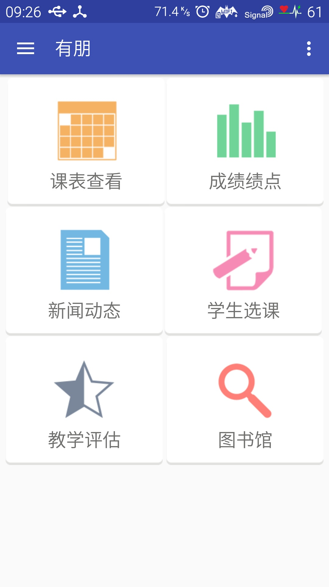
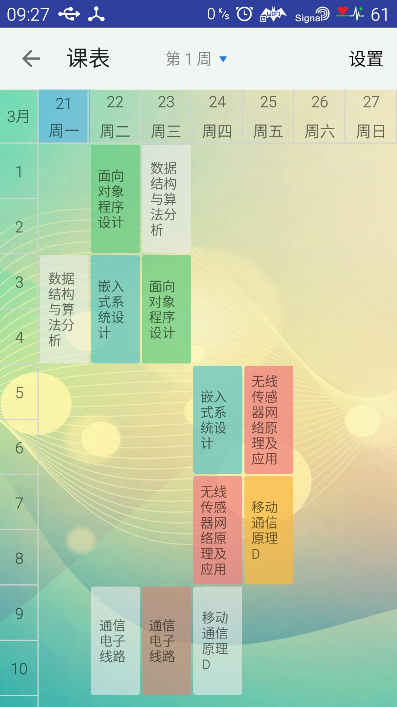
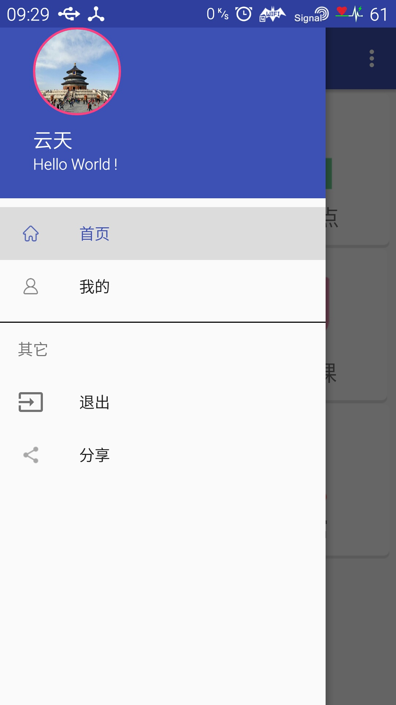

有朋是长春大学专属Android app 目前实现的功能有课表查看,成绩查看.
[演示apk](./screenshots/youpeng_demo.apk)

用到的开源库 
[okhttp](https://github.com/square/okhttp) 
[jsoup](http://jsoup.org/) 
[shimmer](https://github.com/RomainPiel/Shimmer-android) 

License
============

    Copyright 2016 YunTian

	Licensed under the Apache License, Version 2.0 (the "License");
	you may not use this file except in compliance with the License.
	You may obtain a copy of the License at

     http://www.apache.org/licenses/LICENSE-2.0

	Unless required by applicable law or agreed to in writing, software
	distributed under the License is distributed on an "AS IS" BASIS,
	WITHOUT WARRANTIES OR CONDITIONS OF ANY KIND, either express or implied.
	See the License for the specific language governing permissions and
	limitations under the License.

